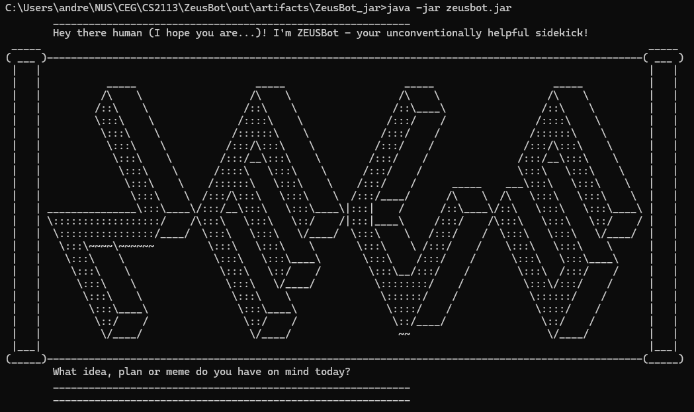

# ZeusBot User Guide

--------------------------------------------------------------------------------------------------------------------

ZeusBot is a **Command Line Interface-based (CLI-based) chatbot** that will be your best friend in **managing your tasks** efficiently. Under tasks, it further supports **todos, deadlines and events**. The data loaded and stored are done through a **local test file** for continuous usage.

--------------------------------------------------------------------------------------------------------------------

## Content Log
* [Quick Start](#quick-start)
* [Features](#features)
  * [Enumerating all tasks](#enumerating-all-tasks-list)
  * [Adding a todo task](#adding-a-todo-task-todo)
  * [Adding a deadline task](#adding-a-deadline-task-deadline)
  * [Adding an event task](#adding-an-event-task-event)
  * [Enumerating tasks with keyword](#enumerating-tasks-with-keyword-find)
  * [Marking a task as completed](#marking-a-task-as-completed-mark)
  * [Unmarking a task as completed](#unmarking-a-task-as-completed-unmark)
  * [Removing a task](#removing-a-task-delete)
  * [Bidding farewell to user](#bidding-farewell-to-user-bye)
  * [Saving the data](#saving-the-data)
  * [Editing the data file](#editing-the-data-file)

--------------------------------------------------------------------------------------------------------------------
## Quick Start

1. Ensure you have Java `17` or above installed in your Computer. 
   **Mac users:** Ensure you have the exact JDK version prescribed [here](https://se-education.org/guides/tutorials/javaInstallationMac.html).

2. Download the latest `.jar` file from [here](https://github.com/asytrix99/ip/releases/download/A-Jar/ZeusBot.jar).

3. Copy the file of the folder you want to use as the _home folder_ for your ZeusBot.

4. Open the command terminal, type in `cd` into the folder you put the `.jar` file in, and use the `java -jar ZeusBot.jar` command to run the chatbot application. 
   A Terminal User Interface (TUI) similar to the below image should pop up immediately with a greeting and a user input prompt. 
    

5. Type the command in the user command prompt and press Enter to execute it. 
    A quick summary to some commands you can try:
    * `list`: Enumerates all tasks.
    * `todo DESCRIPTION`: Adds a task with a description.
    * `deadline DESCRIPTION /by BY`: Adds a task with a description and a deadline.
    * `event DESCRIPTION /from FROM /to TO`: Adds a task with a description, a start date and an end date.
    * `find KEYWORD`: Enumerates tasks wth descriptions containing the provided keyword.
    * `mark TASK_INDEX`: Marks a task as done.
    * `unmark TASK_INDEX`: Unmarks a task as done.
    * `delete TASK_INDEX`: Deletes the task at the provided index.
    * `bye`: Ends the current session and exits ZeusBot.

6. Refer to the [Features](#features) below for details of each command.

--------------------------------------------------------------------------------------------------------------------

## Features

**Notes about the command format:**
* Words in `UPPER_CASE` are parameters to be provided by the user. 
    e.g., in `todo DESCRIPTION`, `DESCRIPTION` is a parameter.
* Parameters must adhere to the order of input of `<command> DESCRIPTION` for each command.

### Enumerating all tasks: `list`
Lists out all tasks loaded in the saved text file with indexes. 

Format: `list`

### Adding a todo task: `todo`
Adds a task with only a description to the list.

Format: `todo DESCRIPTION`
* `DESCRIPTION` must have at least one argument.
* The number of arguments in `DESCRIPTION` does not matter, parsing handles this.

Examples:
* `todo assignment` Adds a task with description `assignment`.
* `todo finish reading book` Adds a task wth description `finish reading book`.

### Adding a deadline task: `deadline`
Adds a task with a description and a provided due date.

Format: `deadline DESCRIPTION /by BY`
* `DESCRIPTION` and `BY` are required in user input.
* The number of arguments in `DESCRIPTION` must have at least one argument.
* The number of arguments in `DESCRIPTION` does not matter, parsing handles this.
* `BY` is required to be in the format `yyyy-MM-dd` and with the correct delimiter `-`.
* `BY` will only accept a valid date that is either on the current date or a future date.
* `BY` will be parsed automatically into String format `MMM d yy` using `java.time.format.DateTimeFormatter`.

Examples:
* `deadline finish assignment /by 2025-09-27` Adds a task with description `finish assignment` with a due date `27 Sep 2025`.

### Adding an event task: `event`
Adds a task with a description, alongside start and end dates.

Format: `event DESCRIPTION /from FROM /to TO`
* `DESCRIPTION`, `FROM` and `TO` are required in the user input.
* The number of arguments in `DESCRIPTION` must have at least one argument.
* The number of arguments in `DESCRIPTION` does not matter, parsing handles this.
* `FROM` and `TO` are required to be in the format `yyyy-MM-dd` and with the correct delimiter `-`.
* `FROM` and `TO` will only accept a valid date that is either on the current date or a future date.
* `TO` will not accept a date that is before `FROM`.
* `FROM` and `TO` will be parsed automatically into String format `MMM d yy` using `java.time.format.DateTimeFormatter`.

Examples:
* `event assignment period /from 2025-09-27 /to 2025-09-30` Adds a task with description `assignment period` with start date of `27 Sep 2025` to `30 Sep 2025`.

### Enumerating tasks with keyword: `find`
Lists out tasks in a manner similar to the `list` command containing the provided keyword.

Format: `find KEYWORD`
* `KEYWORD` are required in the user input.
* `KEYWORD` only accepts one argument.

Examples:
* `find book` Returns a filtered task list of 3 tasks from the original list of 6 as shown in below's example. 

### Marking a task as completed: `mark`
Marks a task currently existing in the task list as completed.

Format: `mark TASK_INDEX`
* `TASK_INDEX` will only accept positive values (greater than `0`).
* `TASK_INDEX` will not accept values greater than the number of tasks in the current list.
* `TASK_INDEX` will only accept one argument.
* If the particular task corresponding to the provided `TASK_INDEX` has already been marked, user will be alerted.

Examples:
* `mark 2` Marks task at index 2 as completed, prevents duplicate marking as shown below. 

### Unmarking a task as completed: `unmark`
Unmarks a task currently existing in the task list as completed.

Format: `unmark TASK_INDEX`
* `TASK_INDEX` will only accept positive values (greater than `0`).
* `TASK_INDEX` will not accept values greater than the number of tasks in the current list.
* `TASK_INDEX` will only accept one argument.
* If the particular task corresponding to the provided `TASK_INDEX` has already been unmarked, user will be alerted.

Examples:
* `unmark 2` unmarks task at index 2 as completed, prevents duplicate unmarking as shown below. 

### Removing a task: `delete`
Removes a task currently existing in the task list with the specified task index.

Format: `delete TASK_INDEX`
* `TASK_INDEX` will only accept positive values (greater than `0`).
* `TASK_INDEX` will not accept values greater than the number of tasks in the current list.
* `TASK_INDEX` will only accept one argument.

Examples:
* `delete 5` removes task at index 5 and updates the list as shown below. 

### Bidding farewell to user: `bye`
Ends current session.

Format: `bye`
* The text file `docs/zeusbot.txt` is saved with the updated list of tasks.
* The updated text file can be reloaded into the next session as per normal usage.

### Saving the data
ZeusBot data is being saved in the hard disk automatically after any `add`, `mark`, `unmark` or `delete` commands through parsing into the `zeusbot.txt` file inside the `docs` directory.

### Editing the data file
Be cautious when editing the saved text tile since a certain format is required of each task so that they can be properly loaded into each session. The `Parser` class handles invalid lines by ignoring them if they do not match the required format for loading in the tasks.
